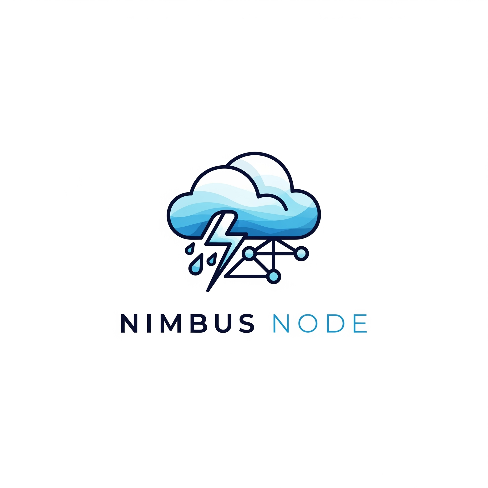

# 🌩️ Nimbus Node

**Nimbus Node** est une pipeline légère permettant de collecter automatiquement les données météorologiques à l’aide de l’API OpenWeather. Le système prend en charge la collecte pour plusieurs villes en parallèle grâce au multithreading.

---

## 🚀 Fonctionnalités

- 📡 Requête régulière à l’API OpenWeather  
- 🌍 Support de plusieurs villes simultanément  
- 🧵 Multithreading pour des appels non-bloquants  
- 🗃️ Enregistrement des données météo dans des fichiers `.json`  
- 🛠️ Configuration simple via un fichier JSON  

---

## 🛠️ Configuration

Tout est centralisé dans le fichier `config/setting.json` :

```json
{
  "key": "votre_clé_API_openweather",
  "city": [
    "Evreux,Fr",
    "Chartres,Fr",
    "Lille,Fr",
    "Orléans,Fr",
    "Liège,Be"
  ],
  "time_call_api": 5 /* durée d'appel entre les deux api */
}
```


## 🔑 Clés disponibles

key : votre clé API personnelle fournie par OpenWeather (https://openweathermap.org/api).

city : une liste de villes à interroger.
Exemple :

Pour une seule ville : ["Evreux,Fr"]

Pour plusieurs : ["Evreux,Fr", "Chartres,Fr", "Lille,Fr", "Orléans,Fr", "Liège,Be"]

## 🧪 Lancement de la pipeline
Depuis le terminal, lancez la collecte avec :

```
python main.py

ou

make launch (si make disponible)
```
La collecte s’effectue automatiquement selon le délai défini (par défaut : 10 minutes).

## 📁 Structure du projet


```
nimbus-node/
│
├── api/                 # Appels à l'API météo
│   └── weather_api.py
│
├── config/              # Fichiers de configuration
│   └── setting.json
│
├── storage/             # Gestion de l’écriture des fichiers
│   └── file_writer.py
│
├── datalog/             # Données météo enregistrées (JSON)
│   └── data.json
│
├── pipeline/            # Pipeline de collecte principale
│   └── pipeline.py
│
├── file_parsers/        # Function pour parser les fichiers/API
│
├── main.py              # Point d’entrée
```

## 📦 Installation

Clonez ce dépôt :

```
    git clone https://github.com/testeh69/nimbus-node.git
    cd nimbus-node


    python -m venv venv
    source venv/bin/activate  # sous Linux/macOS
    venv\Scripts\activate     # sous Windows
```

## 📈 Idées d'amélioration

🔁 Fréquence adaptative basée sur la similarité des données météo

🤖 Intégration d’un agent de reinforcement learning (RL) pour optimiser les appels API

📊 Interface graphique ou dashboard de visualisation

🧠 Intégration avec une base de données pour l’analyse long terme

